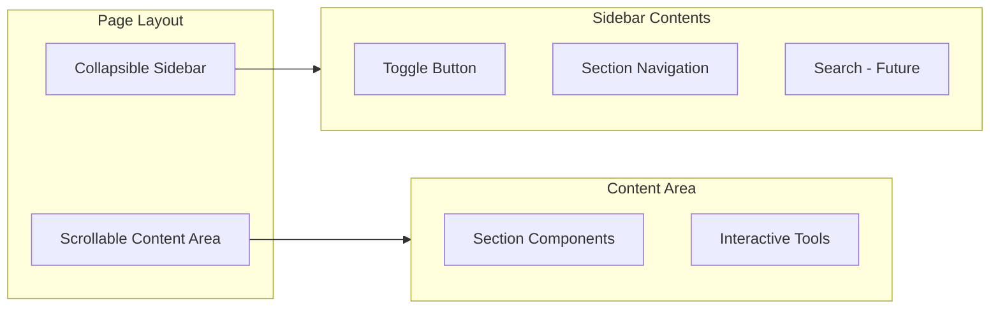
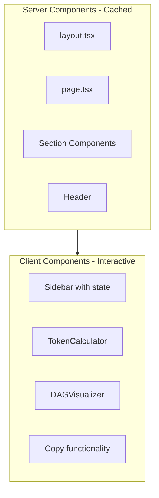

# AI Engineering Guide - Comprehensive Redesign

## Vision

A single continuous-scroll page that reads like a book but navigates like documentation. Engineers can read linearly or jump to specific sections. Content is server-rendered and cached; interactive tools (calculators, visualizers, code examples) run client-side.

---

## Architecture Overview



### Layout Pattern

```
+------------------------------------------+
|  Header (sticky, minimal)                |
+------+-----------------------------------+
|      |                                   |
| Side |   Main Content (infinite scroll)  |
| bar  |                                   |
| (col-|   [Section 1]                     |
| laps-|   [Section 2]                     |
| ible)|   [Section 3]                     |
|      |   ...                             |
|      |                                   |
+------+-----------------------------------+
```

- **Sidebar**: Collapsible, shows section titles, highlights current section as user scrolls
- **Content**: Full-width when sidebar collapsed, continuous scroll
- **Intersection Observer**: Tracks which section is in view, updates sidebar highlight

---

## Content Sections (Expandable)

The content structure is designed to grow. Initial sections:

### Part 1: Foundations

| Section | Key Concepts | Interactive |

|---------|--------------|-------------|

| **Intro** | What this is, who it's for | - |

| **The Mental Model** | LLM as stateless function, not chat | Function signature code example |

| **Context Engineering** | Signal vs noise, pure context, state accumulation problems | Token cost calculator |

| **Prompt Anatomy** | System prompts, user prompts, structured outputs | Code examples |

### Part 2: Retrieval and Knowledge

| Section | Key Concepts | Interactive |

|---------|--------------|-------------|

| **RAG Fundamentals** | What RAG is, when to use it, embedding basics | - |

| **Vector Databases** | PGVector, Pinecone, similarity search | Code examples |

| **Chunking Strategies** | Document splitting, overlap, semantic chunking | Visualizer (future) |

### Part 3: Task Architecture

| Section | Key Concepts | Interactive |

|---------|--------------|-------------|

| **Task Decomposition** | DAG orchestration, LLM compiler concepts | DAG visualizer |

| **Parallelization** | Independent tasks, stacked PRs, dependency graphs | DAG visualizer |

| **Agents and Orchestration** | Multi-agent patterns, tool use | Code examples |

### Part 4: Development Workflow

| Section | Key Concepts | Interactive |

|---------|--------------|-------------|

| **Test-Driven AI Dev** | Harness first, validation, spec-driven prompts | Code examples |

| **Cursor Workflows** | Rules, context, voice, efficient usage | Code examples |

| **Code Review with AI** | Short tasks, fast reviews, iteration patterns | - |

### Part 5: Production Concerns

| Section | Key Concepts | Interactive |

|---------|--------------|-------------|

| **Guardrails** | RBAC, design constraints (not prompt constraints) | Code examples |

| **Cost Optimization** | Token budgeting, caching, model selection | Calculator |

| **Reliability Patterns** | Retries, fallbacks, structured outputs | Code examples |

---

## Component Architecture

```
src/app/
├── components/
│   ├── layout/
│   │   ├── Header.tsx           # Minimal sticky header
│   │   ├── Sidebar.tsx          # Collapsible navigation
│   │   ├── SidebarToggle.tsx    # Toggle button
│   │   └── ContentWrapper.tsx   # Main scroll container
│   │
│   ├── sections/
│   │   ├── index.ts             # Section registry (id, title, component)
│   │   ├── IntroSection.tsx
│   │   ├── MentalModelSection.tsx
│   │   ├── ContextEngineeringSection.tsx
│   │   ├── PromptAnatomySection.tsx
│   │   ├── RAGSection.tsx
│   │   ├── VectorDBSection.tsx
│   │   ├── TaskDecompositionSection.tsx
│   │   ├── WorkflowSection.tsx
│   │   ├── GuardrailsSection.tsx
│   │   └── ... (more as content grows)
│   │
│   ├── tools/
│   │   ├── TokenCalculator.tsx  # Client component
│   │   ├── DAGVisualizer.tsx    # Client component
│   │   └── CostEstimator.tsx    # Client component
│   │
│   └── ui/
│       ├── CodeBlock.tsx        # Syntax highlighting + copy
│       ├── CopyButton.tsx       # Copy to clipboard
│       ├── Card.tsx             # Content card
│       ├── Callout.tsx          # Tips, warnings, notes
│       └── SectionHeading.tsx   # Consistent section headers
│
├── hooks/
│   └── useActiveSection.ts      # Intersection observer hook
│
├── data/
│   ├── sections.ts              # Section metadata (order, titles, ids)
│   └── models.ts                # LLM pricing data
│
├── globals.css
├── layout.tsx
└── page.tsx
```

---

## Technical Implementation

### Server vs Client Components



- **Server-rendered**: All section content, static UI
- **Client-side**: Sidebar toggle state, scroll tracking, calculators, copy buttons

### Section Registry Pattern

```typescript
// src/app/data/sections.ts
export const sections = [
  { id: 'intro', title: 'Introduction', component: IntroSection },
  { id: 'mental-model', title: 'The Mental Model', component: MentalModelSection },
  { id: 'context', title: 'Context Engineering', component: ContextEngineeringSection },
  // ... easily add more
] as const;
```

This pattern allows:

- Easy reordering of sections
- Automatic sidebar generation
- Simple addition of new sections
- Type-safe section references

### Scroll Tracking

```typescript
// useActiveSection hook
// Uses IntersectionObserver to track which section is in view
// Updates sidebar highlight accordingly
// Debounced for performance
```

---

## Design System

### Color Palette (CSS Variables)

| Variable | Light | Dark | Usage |

|----------|-------|------|-------|

| `--bg-primary` | `#fafafa` | `#09090b` | Page background |

| `--bg-secondary` | `#ffffff` | `#18181b` | Cards, sidebar |

| `--bg-tertiary` | `#f4f4f5` | `#27272a` | Code blocks |

| `--text-primary` | `#09090b` | `#fafafa` | Headings |

| `--text-secondary` | `#3f3f46` | `#a1a1aa` | Body text |

| `--text-muted` | `#71717a` | `#71717a` | Captions |

| `--border` | `#e4e4e7` | `#27272a` | Borders |

| `--accent` | `#0284c7` | `#38bdf8` | Links, highlights |

### Typography

- **Headings**: System sans-serif (clean, professional)
- **Body**: System sans-serif, generous line-height
- **Code**: `Geist Mono` or `JetBrains Mono` - monospace throughout for code

### Spacing Scale

Consistent spacing using Tailwind's scale: `4, 8, 12, 16, 24, 32, 48, 64`

---

## Implementation Phases

### Phase 1: Foundation

1. Archive current content to `archive/v1-beginner/`
2. Set up new design system in `globals.css`
3. Build layout shell (Header, Sidebar, ContentWrapper)
4. Implement section registry pattern
5. Create `useActiveSection` hook

### Phase 2: Core UI Components

1. Build `CodeBlock` with syntax highlighting and copy
2. Build `Card`, `Callout`, `SectionHeading`
3. Style sidebar with section highlighting

### Phase 3: Skeleton Content

1. Create all section components with placeholder content
2. Wire up section registry
3. Test scroll behavior and sidebar tracking

### Phase 4: Interactive Tools

1. `TokenCalculator` - model picker, token inputs, cost display
2. `DAGVisualizer` - basic node graph (SVG or simple library)
3. Code example copy functionality

### Phase 5: Content Population

- Fill in sections incrementally (this is ongoing work)

---

## Future Considerations (Not in Initial Scope)

- **Search**: Full-text search across sections (could use Fuse.js client-side)
- **Progress tracking**: localStorage-based "you've read X sections"
- **Export**: Download sections as markdown
- **Deep linking**: URL hash updates as you scroll
- **Keyboard navigation**: j/k to move between sections