# AI Engineering Guide - V3 Transformation

## Vision

Transform the guide into an **interactive curriculum** where:

- Every concept has a visualization users can interact with
- Core logic is viewable (simplified, educational) via "View Code" toggles
- Content flows logically with clear prerequisites
- No information is lost - only gained

---

## Complete Content Flow

```mermaid
flowchart TD
    subgraph part1 [Part 1: Foundations]
        s1[1. Introduction]
        s2[2. How LLMs Work]
        s3[3. The Mental Model]
        s4[4. Understanding Embeddings]
        s5[5. LLM Caching]
    end

    subgraph part2 [Part 2: Context Engineering]
        s6[6. Context Principles]
        s7[7. Layered Context Architecture]
        s8[8. Context Lifecycle]
    end

    subgraph part3 [Part 3: Capabilities]
        s9[9. Structured Outputs]
        s10[10. Tools and Function Calling]
        s11[11. The Agentic Loop]
        s12[12. Workflows vs Agents]
    end

    subgraph part4 [Part 4: Knowledge and Retrieval]
        s13[13. RAG Fundamentals]
        s14[14. Vector Databases]
        s15[15. Chunking Strategies]
    end

    subgraph part5 [Part 5: Orchestration]
        s16[16. Task Decomposition]
        s17[17. Orchestration Patterns]
        s18[18. Parallelization]
        s19[19. Delegation and Subagents]
        s20[20. Skills and Progressive Discovery]
        s21[21. Model Routing]
    end

    subgraph part6 [Part 6: Safety and Control]
        s22[22. Guardrails and RBAC]
        s23[23. Human-in-the-Loop]
        s24[24. External Control Patterns]
    end

    subgraph part7 [Part 7: Evaluation]
        s25[25. Harnesses and Evaluation]
        s26[26. Test-Driven AI Development]
    end

    subgraph part8 [Part 8: Coding Agents]
        s27[27. What are Coding Agents]
        s28[28. Cursor Architecture]
        s29[29. Rules and Context]
        s30[30. Cursor Modes]
        s31[31. Effective Patterns]
        s32[32. Background Agents]
    end

    subgraph part9 [Part 9: Development Workflow]
        s33[33. Spec-Driven Development]
        s34[34. CI/CD Iteration]
        s35[35. Graphite and Stacked PRs]
        s36[36. Linear and Task Management]
        s37[37. E2E Agentic Pipeline]
    end

    subgraph part10 [Part 10: Production]
        s38[38. Cost Optimization]
        s39[39. Reliability Patterns]
    end

    part1 --> part2 --> part3 --> part4 --> part5 --> part6 --> part7 --> part8 --> part9 --> part10
```

---

## Section Details

### Part 1: Foundations (5 sections)

| # | Section | Status | Interactive Element | Core Logic View |

|---|---------|--------|---------------------|-----------------|

| 1 | **Introduction** | Refactor | Interactive roadmap showing learning path | N/A |

| 2 | **How LLMs Work** | NEW | Animated visualization of pre-training → RLHF → reasoning | Token prediction logic |

| 3 | **The Mental Model** | Enhance | Cost visualizer (exists), add stateless function demo | Function call simulation |

| 4 | **Understanding Embeddings** | Extract from RAG | Embedding visualizer (exists), enhance with similarity demo | Cosine similarity calc |

| 5 | **LLM Caching** | Enhance | Caching cost explorer (exists), add prefix match visualization | Cache hit/miss logic |

### Part 2: Context Engineering (3 sections)

| # | Section | Status | Interactive Element | Core Logic View |

|---|---------|--------|---------------------|-----------------|

| 6 | **Context Principles** | Refactor | Signal-to-noise visualizer, attention heatmap | Token relevance scoring |

| 7 | **Layered Context Architecture** | Extract | Layer builder tool - drag/drop to arrange context | Layer ordering algorithm |

| 8 | **Context Lifecycle** | Extract | Summarization demo with sliding window viz | Compression strategy |

### Part 3: Capabilities (4 sections)

| # | Section | Status | Interactive Element | Core Logic View |

|---|---------|--------|---------------------|-----------------|

| 9 | **Structured Outputs** | NEW | Schema builder with live validation | Zod schema → JSON |

| 10 | **Tools and Function Calling** | NEW | Tool definition playground, invocation simulator | Tool dispatch logic |

| 11 | **The Agentic Loop** | NEW | Step-through animation of agent loop with state viz | Loop controller |

| 12 | **Workflows vs Agents** | NEW | Side-by-side comparison: workflow DAG vs agent decisions | Decision tree logic |

### Part 4: Knowledge & Retrieval (3 sections)

| # | Section | Status | Interactive Element | Core Logic View |

|---|---------|--------|---------------------|-----------------|

| 13 | **RAG Fundamentals** | Refactor | RAG visualizer (exists), pipeline step-through | Retrieval pipeline |

| 14 | **Vector Databases** | Expand | Vector space navigator, ANN search viz | HNSW search logic |

| 15 | **Chunking Strategies** | Expand | Document chunker with strategy comparison | Chunking algorithms |

### Part 5: Orchestration (6 sections)

| # | Section | Status | Interactive Element | Core Logic View |

|---|---------|--------|---------------------|-----------------|

| 16 | **Task Decomposition** | Expand | Task DAG builder, dependency visualizer | DAG construction |

| 17 | **Orchestration Patterns** | Move/Enhance | Orchestration viz (exists), add pattern library | Pattern execution |

| 18 | **Parallelization** | Expand | Parallel vs serial timeline comparison | Async orchestrator |

| 19 | **Delegation and Subagents** | Extract | Context isolation visualizer, handoff animation | Delegation protocol |

| 20 | **Skills & Progressive Discovery** | Refactor | Skill registry browser, loading animation | Progressive loader |

| 21 | **Model Routing** | Enhance | Router simulator with cost/latency tradeoffs | Routing classifier |

### Part 6: Safety & Control (3 sections)

| # | Section | Status | Interactive Element | Core Logic View |

|---|---------|--------|---------------------|-----------------|

| 22 | **Guardrails and RBAC** | Expand | Permission matrix builder, constraint checker | RBAC evaluator |

| 23 | **Human-in-the-Loop** | NEW | Approval flow simulator, confidence thresholds | Approval logic |

| 24 | **External Control Patterns** | Keep/Enhance | Outer loop visualizer, safety boundary demo | Control flow |

### Part 7: Evaluation (2 sections)

| # | Section | Status | Interactive Element | Core Logic View |

|---|---------|--------|---------------------|-----------------|

| 25 | **Harnesses and Evaluation** | Expand | Test harness builder, eval metrics dashboard | Harness runner |

| 26 | **Test-Driven AI Development** | Integrate | Red-green-refactor animation with AI in loop | TDD cycle |

### Part 8: Coding Agents - Cursor Focus (6 sections)

| # | Section | Status | Interactive Element | Core Logic View |

|---|---------|--------|---------------------|-----------------|

| 27 | **What are Coding Agents** | NEW | Agent capability comparison chart | N/A (conceptual) |

| 28 | **Cursor Architecture** | Keep/Enhance | Architecture diagram with interactive exploration | Context assembly |

| 29 | **Rules and Context Management** | Keep/Enhance | Rules file editor with preview | Rule parser |

| 30 | **Cursor Modes** | Keep/Enhance | Mode comparison with use case matcher | Mode selector |

| 31 | **Effective Usage Patterns** | Keep/Enhance | Pattern library with success metrics | Pattern matcher |

| 32 | **Background Agents** | Keep/Enhance | Background task monitor simulation | Task queue |

### Part 9: Development Workflow (5 sections)

| # | Section | Status | Interactive Element | Core Logic View |

|---|---------|--------|---------------------|-----------------|

| 33 | **Spec-Driven Development** | Keep/Enhance | Spec → implementation flow viz | Spec validator |

| 34 | **CI/CD Iteration Loops** | Keep/Enhance | Pipeline visualizer with iteration tracking | Retry logic |

| 35 | **Graphite and Stacked PRs** | Keep/Enhance | Stack visualizer, rebase animation | Stack manager |

| 36 | **Linear and Task Management** | Keep/Enhance | Issue → PR flow diagram | Task router |

| 37 | **E2E Agentic Pipeline** | Keep/Enhance | Full pipeline orchestration demo | Pipeline executor |

### Part 10: Production (2 sections)

| # | Section | Status | Interactive Element | Core Logic View |

|---|---------|--------|---------------------|-----------------|

| 38 | **Cost Optimization** | Expand | Token budget calculator, model cost comparison | Budget allocator |

| 39 | **Reliability Patterns** | Expand | Retry/fallback simulator, circuit breaker demo | Reliability wrapper |

---

## Shared Components to Build

Before section work, create reusable infrastructure:

| Component | Purpose |

|-----------|---------|

| `ViewCodeToggle` | Wrapper that adds "View Code" button to any visualization |

| `InteractiveWrapper` | Standard frame for interactive elements with controls |

| `StepThroughPlayer` | Playback controls for animated sequences |

| `CodeLogicPanel` | Syntax-highlighted panel for showing core logic |

---

## Implementation Phases

### Phase 0: Infrastructure (2 tasks)

- Create shared visualization components
- Restructure `sections.ts` with new organization

### Phase 1: Foundations (5 tasks)

- Sections 1-5

### Phase 2: Context Engineering (3 tasks)

- Sections 6-8

### Phase 3: Capabilities (4 tasks)

- Sections 9-12 (highest priority NEW content)

### Phase 4: Retrieval (3 tasks)

- Sections 13-15

### Phase 5: Orchestration (6 tasks)

- Sections 16-21

### Phase 6: Safety (3 tasks)

- Sections 22-24

### Phase 7: Evaluation (2 tasks)

- Sections 25-26

### Phase 8: Coding Agents (6 tasks)

- Sections 27-32

### Phase 9: Workflow (5 tasks)

- Sections 33-37

### Phase 10: Production (2 tasks)

- Sections 38-39

---

## Total: 41 Section Tasks + 2 Infrastructure = 43 Commits

Each task:

1. Creates/refactors section content
2. Builds interactive visualization
3. Implements "View Code" with core logic
4. Updates section registry
5. Tests responsiveness and interactivity